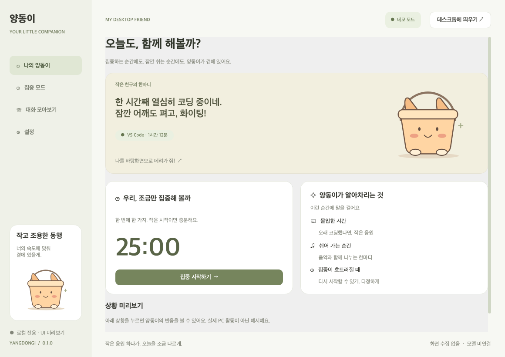
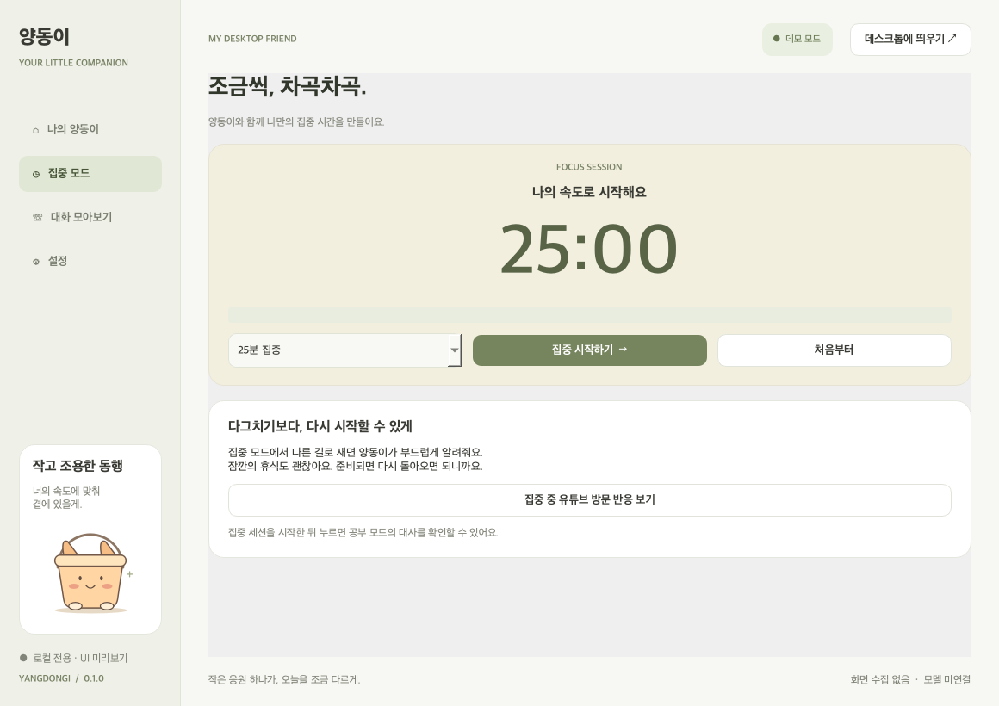
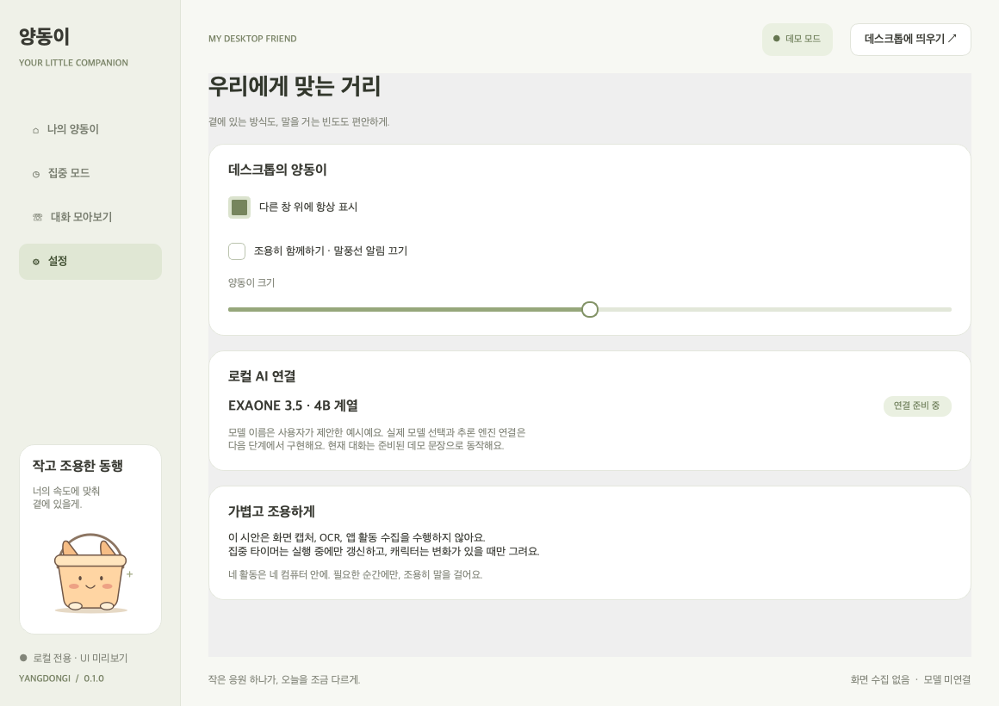

# 양동이

**너의 하루에, 작은 친구.** Windows 데스크톱 위에서 함께하는 로컬 AI 펫의 PySide6 프론트엔드 시안입니다.



## Windows에서 실행

Python 3.11 이상을 설치하고 저장소를 내려받은 다음 **`run_windows.bat`**을 실행하세요. 가상환경과 PySide6를 설치한 뒤 앱을 시작합니다. 최초 의존성 설치에는 인터넷 연결이 필요합니다. 앱 자체는 네트워크를 사용하지 않습니다.

PowerShell에서 직접 실행할 수도 있습니다.

```powershell
py -3 -m venv .venv
.\.venv\Scripts\python.exe -m pip install -r requirements.txt
.\.venv\Scripts\python.exe -m yangdongi
```

## 이번 시안에 포함된 것

- **나의 양동이**: 캐릭터, 상황별 말풍선, 집중 타이머, 세 가지 환경 반응 데모
- **집중 모드**: 25·45·50분 선택, 시작·일시정지·초기화, 완료 메시지
- **대화 모아보기**: 입력과 데모 응답, 현재 실행 중의 최근 메시지 최대 100개
- **설정**: 항상 위에 표시, 조용히 모드, 캐릭터 크기 및 위치 저장
- **데스크톱 펫**: 투명 배경, 프레임 없는 창, 드래그 이동, 더블클릭으로 패널 열기, 우클릭 메뉴
- **시스템 트레이**: 패널 복원·펫 표시·종료. 트레이가 있으면 창의 X는 패널을 숨기며, 완전 종료는 트레이/펫 우클릭 메뉴의 `종료`입니다.

처음 실행하면 패널과 펫이 함께 나타납니다. `상황 미리보기`의 버튼을 누르면 코딩·음악·유튜브 대사를 확인할 수 있습니다. 집중 모드를 시작하고 유튜브를 선택하면 복귀를 권하는 대사가 나옵니다. 조용히 모드에서는 상황별 대사와 펫 말풍선을 띄우지 않습니다. 직접 입력한 대화에는 데모 응답이 표시됩니다.

**실제 활동 감지, 음악 장르 분석, OCR, 로컬 LLM 추론은 아직 연결하지 않았습니다.** 표시된 VS Code 사용 시간과 음악 장르는 예시 데이터입니다. 모델 표기는 사용자가 제안한 예시이며, 모델 배포명과 런타임 호환성은 백엔드 연결 시 확정합니다. 대화 기록은 디스크에 저장하지 않습니다.

## 화면

| 집중 모드 | 설정 |
| --- | --- |
|  |  |

[대화 화면](docs/chat.png) · [투명 배경 펫](docs/pet.png) · [디자인 및 백엔드 연결 가이드](docs/design.md)

## Windows 실행 파일

GitHub Actions의 **Windows desktop build**가 테스트 후 PyInstaller로 `Yangdongi-Windows` 아티팩트를 생성합니다. 성공한 실행의 아티팩트를 내려받아 압축을 풀고 `Yangdongi.exe`를 실행하세요. `_internal` 등 함께 생성된 파일을 같은 폴더에 유지해야 합니다. 코드 서명 및 설치 프로그램은 포함하지 않습니다.

Windows에서 직접 빌드:

```powershell
.\.venv\Scripts\python.exe -m pip install pyinstaller
.\.venv\Scripts\python.exe -m PyInstaller --noconfirm --windowed --name Yangdongi --collect-all PySide6 run.py
```

## 개발과 검증

```bash
python -m pip install -r requirements.txt pytest
python -m pytest -q
python -m docs.render_preview
```

Qt offscreen 테스트는 타이머 수명 주기, 공부 모드별 반응, 조용히 모드, 페이지 이동, 채팅, 설정 적용을 검증합니다. 미리보기는 실제 Qt 위젯을 렌더링한 PNG입니다. Windows의 실제 바탕화면 위 고정, 트레이, 다중 모니터/DPI 동작은 Windows 데스크톱에서 수동 검증해야 합니다.

구현 참고: [Qt QWidget 투명 창 문서](https://doc.qt.io/qtforpython-6/PySide6/QtWidgets/QWidget.html), [Qt 창 플래그](https://doc.qt.io/qtforpython-6/PySide6/QtCore/Qt.html).
